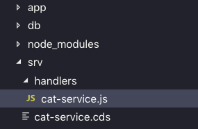
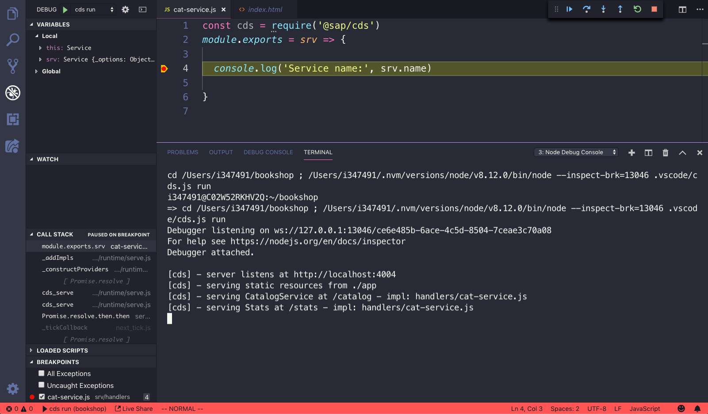

# Exercise 08 - Adding custom service implementation logic

In this exercise you'll learn how to add custom processing of specific OData operations on your services. It's done by adding [custom implementation logic](https://help.sap.com/viewer/65de2977205c403bbc107264b8eccf4b/Cloud/en-US/68af515a26d944c38d81fd92ad33681e.html) (in JavaScript) via well-defined hooks into the service API.

Along the way you'll also learn how to use debugging features in VS Code, with the [launch configuration](https://code.visualstudio.com/docs/editor/debugging#_launch-configurations) provided by the `cds init` command that you used in an earlier exercise.

With custom implementation logic you can turn an out of the box service into more or less whatever you need, in a clean and minimal way.


## Steps

At the end of these steps you will have modified the `CatalogService` in such a way that books with a high stock value will be discounted (and for the sake of simplicity with this simple data model, the discount will be shown in the book's title).


### 1. Create the outline of a custom logic handler

Custom logic for a given service definition is provided in a JavaScript file that shares the same base name as that definition file. For example, for a service definition file `my-service.cds` the custom logic should be placed in a file `my-service.js`.

This custom logic file can be placed either in the same directory as the service definition file (i.e. side-by-side with it), or in a separate `handlers/` directory. We will use the latter approach.

:point_right: Create a new directory `handlers/` in the `srv/` directory, and in it, create a new file `cat-service.js`. You should end up with something like this:




### 2. Add some basic custom logic code

In the new file `cat-service.js`, add the following code:

```javascript
const cds = require('@sap/cds')
module.exports = srv => {

  console.log(srv.name)

}
```

You can see that this custom logic handler file is in the form of a module, which exports a single function. That function (defined using [ES6 arrow functions](https://developer.mozilla.org/en-US/docs/Web/JavaScript/Reference/Functions/Arrow_functions)) has a single parameter `srv` to receive the server object on invocation. We will be making use of the general CDS API so we require load that module (`require('@sap/cds')`) too.


### 3. Run the service

:point_right: In the same way you've started the service in previous exercises, simply start the service now:

```sh
user@host:~/bookshop
=> cds serve all
```

You should see a few interesting lines in the output, highlighted here:

```
user@host:~/bookshop
=> cds serve all

[cds] - server listens at http://localhost:4004
[cds] - serving static resources from ./app
[cds] - serving CatalogService at /catalog - impl: handlers/cat-service.js  <--
[cds] - serving Stats at /stats - impl: handlers/cat-service.js             <--
Service name: CatalogService                                                <--
Service name: Stats                                                         <--
[cds] - service definitions loaded from:

  app/index.cds
  app/browse/fiori-service.cds
  db/data-model.cds
  srv/cat-service.cds
  node_modules/@sap/cds/common.cds

[cds] - launched in: 720.034ms
```

The first two ("serving <service> at <endpoint> ...") that we've seen before now have extra information showing that there's a JavaScript implementation that complements the service definition.

Note that as the relationship between the service definition and the handler is at file level, the new `cat-service.js` file is deemed a handler for both services (`CatalogService` and `Stats`) in that service definition file.

In fact, we can see that in the two lines from the call to `console.log` confirm that - the function defined in the module is called twice - once for each service (the first time `srv.name` is "CatalogService", and the second time it's "Stats").


### 4. Set a breakpoint and launch in debug mode

The project already comes with some configuration that works with VS Code for debugging - if you're curious, have a look in the `.vscode/` directory in the root of the project.

It means that you can easily set a breakpoint and launch the service in debug mode using standard VS Code features.

:point_right: Before proceeding with the main part of this step, make sure the service is not running service - go to the integrated terminal and stop it with Ctrl-C.

:point_right: Now, set a breakpoint on the `console.log` line you added in the custom logic handler, by clicking in the gutter to the left of the line (or hitting F9 when on the line), to set a red mark as shown:


:point_right: Start the service in debug mode by using menu option "Debug -> Start Debugging", or simply hit F5. VS Code should switch to the debug perspective on the left hand side, and the service should start running, pausing at the `console.log` line as shown:




## Summary


## Questions

